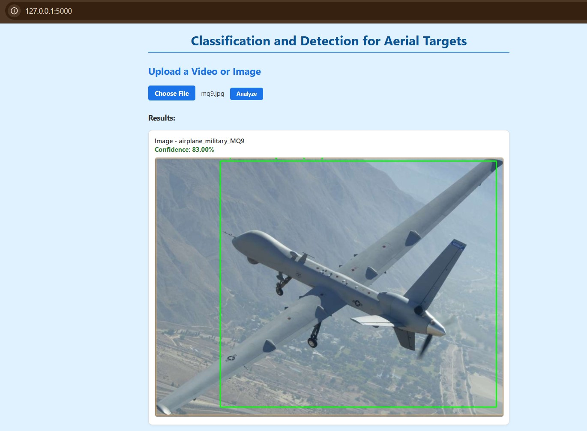

# AirAi Vision – Web UI (Flask Application)

This folder contains the Flask-based web interface for uploading and analyzing aerial target images or videos. The model detects and classifies aircraft, helicopters, and UAVs using a YOLOv8-based object detection system.

---

## Features

- Upload images or videos (`.jpg`, `.png`, `.mp4`)
- Real-time detection using YOLOv8
- Confidence score visualization
- Class names displayed per frame

---

## Project Structure

```bash
ui/
├── app.py                 # Flask app
├── model/
│   ├── best.pt            # YOLOv8 trained weights (Final dataset)
│   └── inference.py       # Detection logic
├── templates/             # HTML UI (index.html)
├── static/                # CSS, JS, styling files
├── uploads/               # Uploaded files (runtime use only)
├── requirements.txt       # Python dependencies
```

## Setup Instructions

### 1. Clone the repository
```bash
git clone https://github.com/sureyyayildirim/aerial-targets-detection-classification.git
cd aerial-targets-detection-classification/ui
```

## 2. Create and activate a virtual environment (Windows)
```bash
python -m venv venv
venv\Scripts\activate
```

## 3. Install dependencies
```bash
pip install -r requirements.txt
```
## 4. Run the Flask app
```bash
python app.py
```
## 5. Open in your browser
```bash
Visit http://127.0.0.1:5000 to use the interface.
```
 
## Live Detection Example

Below is a sample detection using the final model through the web interface:



**📁 Notes**

-The uploads/ folder is used temporarily during file analysis and is ignored in version control.

-The model/best.pt file must match your trained YOLOv8 weights.

-Make sure the paths in inference.py are correctly aligned with your model and data settings.